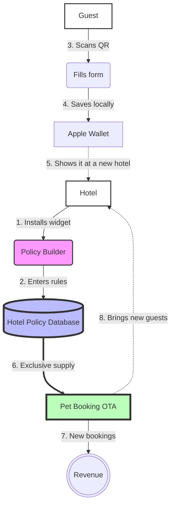

# Pet Policy Widget for Hotels — PM Presentation

---

## Live Prototype — open it first

> Before reading further, open the prototype. This is a working product version that shows the full user journey. The complete flow, from hotel setup to successful pet registration, takes about 3 minutes.

Open the clean prototype here: [Pet Policy Manager](https://www.figma.com/make/SBk8djs5vuL5VWXGa7cAgE/Pet-Policy-Manager?p=f&t=qKz0pyzqNWXuUgch-0).

---

### What the hotel does (Manager)

1. Sets up the rules (Policy Builder): enters hotel details, uploads a logo, sets limits such as weight and breed restrictions, configures fees, and defines stay rules.
2. Gets ready-to-use tools (Dashboard): after saving, the hotel receives a unique guest link, a QR code for the front desk, access to a table of registered pets, and a verification block at reception where staff enter the guest's 6-character code and instantly see the confirmed pet details.

---

### What the guest does (Pet owner)

1. Reviews the rules: opens the link or scans the QR code and sees a clear policy page for that specific hotel, in the hotel's own brand style.
2. Registers the pet: fills in personal and pet details such as breed, weight, and photo. The system automatically checks whether the pet meets the hotel's limits. There is also a separate flow for service animals: when this option is selected, limits and fees are disabled in line with ADA and EU requirements. [Important: this flow is excluded from the current prototype.]
3. Signs the agreement: reads the rules and adds a digital signature directly on the phone screen.
4. Gets the result (Decentralized Data): if everything is valid, the guest sees a green Approved screen with a unique 6-character verification code that is valid for 24 hours. The guest shares the code at reception, staff enter it in the dashboard, and the confirmed pet details appear immediately. After that, the guest taps Add Pet Passport to Apple Wallet or Google Wallet. Pet data is stored locally on the guest's device using a BYOD model. The platform does not keep a guest database on its own servers and acts only as a transit processor for the hotel. This removes most GDPR risk and increases hotel trust.

---

### How to test it yourself

1. Open the prototype. You will land on the hotel setup form.
2. Click Generate My Policy Link at the bottom of the page.
3. In the dashboard, click Preview Guest View to walk through the guest experience.
4. After completing the form, the success screen shows a 6-character verification code. Return to the dashboard and enter it in Verify Guest at Reception to simulate the front-desk scenario.

---

## 1. What problem are we solving?

> The main goal of the MVP is to collect verified hotel policy data and create built-in distribution: every installed widget and every issued wallet pass helps spread awareness. For hotels, the value is different: the widget removes a real operational pain point at reception. That mutual exchange is what makes free adoption justifiable.

Five operational pains the widget solves:

| Pain                                                                                                                 | How it is solved                                                                                                            |
| -------------------------------------------------------------------------------------------------------------------- | --------------------------------------------------------------------------------------------------------------------------- |
| Operational chaos: pet data is collected inconsistently at reception, by email, by phone, and in different formats   | The guest registers the pet online before arrival, the manager gets a ready PDF with the information, and manual work drops |
| No documentation or waiver: there is no single signed document and no action log in case of disputes                 | The guest signs the policy before check-in, the PDF is stored by the manager, and conflict risk drops                       |
| No standardized pet registration process: each guest is handled differently at reception                             | All guests go through the same form, which reduces ad hoc decisions and repetitive questions                                |
| Desync with Housekeeping and Billing: housekeeping does not know where pets are staying, and fees are forgotten      | Automatic notifications or reports for housekeeping and a standardized process for pet fee recording                        |
| Difficulty charging damage deposits: hotels fear property damage, but manual card holds at reception create friction | [Requires research] Automation of deposits and payment integrations still needs validation                                  |

Problem evidence:

- BringFido founder Melissa Halliburton launched the company in 2005 after she and her team manually called thousands of hotels in the US because reliable pet policy information was not available anywhere. Today the business covers 500,000+ properties and has been in market for 21 years. That is a live product built on a live pain.
- PetScreening, backed by a reported $27M Series B, builds its entire pitch around unregistered animals causing lost revenue in residential real estate. The exact dollar figure is PetScreening's own estimate and lacks independent confirmation, but the operational pattern maps closely to hotels.
- No PMS vendor reviewed so far, including Guesty, Mews, and Cloudbeds, offers pre-arrival pet registration, breed or weight validation, a digital waiver, and an insurance-friendly PDF in a single dedicated flow.
- Reddit r/TalesFromTheFrontDesk contains many active threads about pet-related conflicts.

Frequency: a typical boutique hotel with 30 rooms and 70% occupancy is estimated to handle 30 to 50 pet check-ins per month. That estimate still needs to be verified through GM interviews, but even a conservative interpretation means 1 to 2 pet arrivals per day. This is not a rare edge case.

What still needs to be verified: there are no documented hotelier interviews yet. At least 10 Jobs-To-Be-Done interviews are required.

---

## 2. Who is it for?

Primary ICP (Ideal Customer Profile):

> An independent boutique hotel with 20 to 50 rooms in Western Europe, already accepting pets, using a cloud PMS, with the decision made directly by the GM or owner.

Why this segment:

- Smaller than 20 rooms: too few pet stays, low frequency.
- Larger than 50 rooms: 2 to 3 levels of approval, IT involvement, slower sales cycles.
- True boutique 20 to 50 rooms: one decision maker, flexible, cloud-native, already paying roughly €150 to €500+ per month for PMS software, which means SaaS spend is psychologically normal.

HTR Pricing Guide 2026 suggests budget PMS pricing at about $3 to $8 per room per month and premium cloud-native systems at $10 to $20+ per room per month. For 20 to 50 rooms this roughly translates to $60 to $1,000 per month. Mews is positioned above average on price.

Behavioral ICP criteria, more important than demographics:

- Active on Booking.com with the Pets Allowed tag.
- Has experienced operational chaos with pet guest registration: inconsistent data collection, manual work, lost documents, or awkward front-desk decisions.
- Does not have a corporate IT department.

What still needs to be verified: the exact count of 20 to 50 room pet-friendly hotels in the Netherlands, Germany, and the UK. The current estimate of 15,000 to 25,000 properties across Europe is only a working hypothesis and needs to be validated, likely through manual Booking.com counts with filters.

Who is definitely not the target customer:

| Type                                           | Why it is not ICP                                                                     | Diagnostic signal                            |
| ---------------------------------------------- | ------------------------------------------------------------------------------------- | -------------------------------------------- |
| Chain hotel such as Hilton, Marriott, or Accor | Policy is set centrally by the brand, not by the GM                                   | Brand visible in the property name or facade |
| Hotel without a pet policy                     | They do not accept pets, so there is nothing to automate                              | No Pets Allowed tag on any OTA               |
| Heritage property with animal restrictions     | The property cannot accept pets because of building rules or preservation constraints | National listed status or equivalent         |
| Micro-boutique without a site, under 20 rooms  | There is nowhere to embed the widget                                                  | No owned website or booking engine           |
| GM in role for less than 3 months              | Unlikely to adopt new operational tools during the early observation period           | Recent LinkedIn start date                   |
| Hotel in sale process or renovation            | Budget and decision making are frozen                                                 | Public sale or renovation announcement       |

Key implementation risk: front-desk staff do not decide whether the widget is installed, but they can kill adoption after installation. If the widget feels like one more step they must force on guests, they will sabotage it. If it removes an awkward conversation at check-in, they will promote it themselves. This is the main interface challenge for the first product iteration.

---

## 3. What is the value proposition?

For the GM, in 8 seconds:

> Your next guest with a pet has already completed the pet details before arrival, with no paper and no questions at reception.

Standardized pet check-in for hotels that accept pets.

What the product delivers functionally:

| Function                                                 | Value for the hotel                                                                                                                                                                                                    |
| -------------------------------------------------------- | ---------------------------------------------------------------------------------------------------------------------------------------------------------------------------------------------------------------------- |
| Public pet policy page                                   | Guests understand the rules before arrival, which reduces disputes                                                                                                                                                     |
| Breed and weight validation plus service animal handling | Automatic decline if policy is violated, reducing conflict at reception. Legal handling of service animals lowers discrimination risk                                                                                  |
| Digital waiver with signature, IP, and timestamp         | Potentially usable evidence in payment disputes under eIDAS Article 25 and card network compelling evidence rules; for insurance claims it supports the file but does not replace damage photos or a formal assessment |
| PDF sent to hotel email plus housekeeping report         | Useful support document for insurance or property management, plus a summary for housekeeping showing where pets are staying                                                                                           |
| Unique page such as yourdomain.com/p/hotel-name          | Hotel branding without competitor ads                                                                                                                                                                                  |

ROI in one line: one lost chargeback without documentation can cost the hotel real money. Typical pet-related damage may range from €200 to €2,000. A free base widget that captures a digital waiver can provide supporting evidence and protect that amount.

Paid tier ROI still requires research: the B2B monetization model, whether through subscriptions or premium features, needs a full rethink. At the moment the strategic focus is on the data model and future distribution.

Strategic value for the company, as a hypothesis:
Every hotel that configures the widget verifies its own data: allowed breeds, max weight, fee size, stay conditions, walking areas, and operational rules. The objective is to build the deepest, most accurate, and most exclusive database of pet-friendly hotels in Europe, something that cannot be scraped from the public web. That supply-side database becomes the moat for a future specialized pet OTA.

Answer to the fear, You will build an OTA and charge commission like Booking.com:

> Yes, the long-term direction includes a pet-focused OTA, and that is why the tool is free. But it is a different type of OTA. It serves pet travelers who do not currently find the hotel through normal search, for example someone looking for where to stay with a 35 kg Dalmatian in Amsterdam. Those are incremental guests, not a replacement for the direct channel. A 10 to 15 percent commission is lower than Booking.com's 15 to 25 percent range and applies only to the pet segment. Pet policy data is the same type of data hotels already publish on Booking.com and Google. The widget can be removed in one click, with effectively zero switching cost. Revenue is earned only if new guests are brought in.

---

## 4. Who are the competitors?

There are no direct competitors in the exact category. This conclusion was supported by two independent research efforts in February 2026.

| Alternative               | Problem                                                                                                                                                                        | Price                                               |
| ------------------------- | ------------------------------------------------------------------------------------------------------------------------------------------------------------------------------ | --------------------------------------------------- |
| Akia                      | Pet waiver is only one of several templates inside a broader platform. You pay for the full platform, not a dedicated hotel-native pet flow                                    | Requires verification. No public pricing found      |
| Canary Technologies       | No pet functionality found. Positioned across independent properties and large hotel brands                                                                                    | Pricing on request                                  |
| Smartwaiver or WaiverSign | Horizontal waiver tools that do not understand hotel workflows                                                                                                                 | About $15 to $55 per month, but without hotel logic |
| Excel plus PDF plus email | No signature, no action log, no automation                                                                                                                                     | $0, current market default                          |
| Paper waiver              | Lost easily, unreadable, no digital trace                                                                                                                                      | $0, current market default                          |
| Not now, inaction         | The main real competitor is the GM's limited attention, not price. The trigger is usually a pet incident, so selling right after a conflict may work better than cold outreach | $0                                                  |

Competitive position: the product sits alone in the hotel-native plus free quadrant. Akia and Canary are premium platforms with pricing only on request. Horizontal waiver tools do not understand the hotel context. PMS vendors do not offer a standalone pet-specific tool.

Real threat, not immediate but close: PMS vendors such as Mews and Cloudbeds could likely copy the core feature in about two sprints. That is consistent with how platform vendors often absorb narrow upsell features. The realistic window before serious platform risk is around 12 to 18 months.

Why the niche is empty, three possible explanations:

- Venture blind spot: classic VC wants a $1B+ market. Hotel pet policy looks too small at first glance.
- The graveyard is in another segment: failed or absorbed businesses nearby were mostly B2C directories or gig economy services, not B2B hotel tooling.
- PMS vendors solve only the superficial symptom: a simple pets allowed toggle is enough for their roadmap until someone proves real traction in this niche.

---

## 5. Why this team?

The differentiator is not the feature. It is the strategy.

Any PMS can copy a widget. What it cannot copy quickly is a network of 1,000+ hotels with verified, high-resolution pet policy data gathered while incumbents were not paying attention. The moat is verified supply that cannot be scraped.

Comparable architecture patterns:

| Company      | Free B2B tool                                           | Outcome                                                                          |
| ------------ | ------------------------------------------------------- | -------------------------------------------------------------------------------- |
| PetScreening | Widget for landlords that becomes a pet renter database | Reported $27M Series B, though the primary source still needs verification       |
| OpenTable    | Free booking widget for restaurants                     | IPO                                                                              |
| Yelp         | Free business profile                                   | IPO, though some market cap figures commonly quoted still need source validation |

This product is conceptually similar to OpenTable, but for pet travel.

### Data Flywheel Architecture

Internal note: the term Trojan horse should only ever be used in internal strategy discussions. In any material for GMs, investors, or partners, use only Data Flywheel or Supply-Demand Loop. If internal framing leaks into external communication, deals die.



How the flywheel works, with three reinforcing loops:

- Loop 1, badge spread: the hotel gets a Certified Pet Friendly badge, places it on Booking.com and Google, a competitor sees it, feels FOMO, and installs the widget.
- Loop 2, guest viral loop through Apple Wallet: the guest registers a pet at Hotel A, saves the pet passport to the wallet, arrives at Hotel B without the tool, shows the card at reception, and Hotel B installs the widget.
- Loop 3, data flywheel: more hotels with deep rule sets enable a B2C aggregator with unique filters, which attracts more pet travelers, which then makes the badge and supply base more valuable.

Open question: should the company collect a guest database on its own servers after all? The current Apple Wallet and BYOD strategy removes most GDPR risk and lowers hotel fear that guest relationships will be stolen, but it also removes direct email marketing capability when the OTA launches. For now, decentralized storage remains the preferred plan because it accelerates B2B sales.

---

## 6. Why now?

Four windows appear to be open at the same time:

1. Pet travel is a structural trend, not hype. APPA reports the US pet products and services market grew from $103.6B in 2020 to $151.9B in 2024, up 47 percent in four years without a down year. Booking.com and Airbnb both support Pets Allowed as a search filter, though not as a top-level default control.
2. The technology gap is still open. No PMS has solved this problem in a dedicated way. That is not an accident but a roadmap blind spot.
3. Regulatory pressure may be increasing. Public evidence for hospitality-specific legal claims and insurer documentation pressure in Europe is still weak, so this point remains a hypothesis pending interviews and association-level validation.
4. Rules around service animals are getting harder to navigate. Hotels increasingly face both fake emotional support animal claims and legitimate service animal cases. Without a clear legal flow, staff either create conflict or create liability. A product that handles this correctly removes a major reception burden. This flow is critical to the product but intentionally excluded from the current MVP to speed initial launch.

---

## 7. How do we go to market?

Six channels with different time horizons:

| Channel                                                    | Speed                    | Target result                                                                           |
| ---------------------------------------------------------- | ------------------------ | --------------------------------------------------------------------------------------- |
| Founder-led direct sales, 50 cold emails per week          | Fast, 2 to 4 weeks       | First 10 hotels acquired manually                                                       |
| Hotel tech consultants and revenue agencies                | Medium, 4 to 8 weeks     | Access to hotel portfolios through trusted advisors, often 10 to 50 properties per deal |
| PMS marketplace such as Mews or Cloudbeds                  | Slow, 6 to 16 weeks      | 100+ hotels through a platform partner                                                  |
| Viral spread through guests and wallet passes              | Non-linear               | Guests show the pet passport at new hotels                                              |
| Certified Pet Safe badge                                   | Delayed, after 3+ months | Localized FOMO among hotels in specific cities                                          |
| BLLA vendor partnership, roughly $3,500 to $6,500 per year | Medium, 1 to 2 months    | Directory listing and access to boutique hotel conferences, mainly in the US            |

Critical path for the first 90 days:

| Timing      | What                                               | How                                                |
| ----------- | -------------------------------------------------- | -------------------------------------------------- |
| Week 1 to 2 | 10 hotels acquired manually                        | Founder outreach to Amsterdam boutique hotels      |
| Week 3 to 8 | Negotiation and technical integration with one PMS | Realistic timing for marketplace certification     |
| Month 3     | First 5 to 10 hotels through the PMS marketplace   | Marketplace listing starts producing early results |
| Month 3     | 25 active hotels, realistic, or 50 optimistic      | Badge and viral loop are now live                  |

Mews listing caution: from first conversation to live launch the minimum is likely 8 to 12 weeks. It cannot be treated as a primary driver in the first quarter.

What still needs to be verified: no channel has been tested yet. CAC is unknown. The minimum validation test is 50 cold emails to GMs of pet-friendly hotels in Amsterdam, starting now, with zero budget and a two-week window.

Founder-led sales language risk: technical founders tend to sell using terms such as digital workflow, API, and completion rate. Boutique hotel GMs think in RevPAR, chargeback protection, occupancy, and operational simplicity. Without switching languages, the likely outcome is demo hell: meetings happen, deals do not.

Potential near-term event window: Independent Hotel Show Amsterdam, 22 to 23 April 2026, at RAI Amsterdam. This is a relevant event for the independent hotel sector, with 200+ vendors, seminars, and hotelier networking. Dates and venue are confirmed.

---

## 8. How do we measure success?

North Star Metric by stage:

| Stage                   | NSM                         | Definition                                                                   |
| ----------------------- | --------------------------- | ---------------------------------------------------------------------------- |
| Phase 1, 0 to 6 months  | Active hotels               | At least one completed pet check-in in the last 90 days                      |
| Phase 2, 6 to 18 months | Policy depth                | Percentage of hotels that fill more than 80 percent of Policy Builder fields |
| Phase 3, 18+ months     | B2C aggregator transactions | Bookings per month through the future pet OTA                                |

Key Phase 1 metrics:

| Metric                                               | Goal at month 3                            |
| ---------------------------------------------------- | ------------------------------------------ |
| Active hotels with at least one check-in per 90 days | 50 in the optimistic direct-sales scenario |
| Total pet check-ins                                  | 5,000+                                     |
| Guest conversion into Apple Wallet opt-in            | At least 30 percent                        |
| Hotels displaying the badge within 30 days           | At least 30 percent                        |
| New hotel onboarding time                            | Under 10 minutes                           |

Input metrics, the leading indicators the team controls:

| Metric                        | Cadence | Owner                            |
| ----------------------------- | ------- | -------------------------------- |
| Cold emails sent              | Weekly  | Founder                          |
| Onboarding calls completed    | Weekly  | Founder                          |
| QR codes placed in new hotels | Weekly  | Automatic or operational process |

Without input tracking, the team will not know whether NSM is flat because of product issues or because of pipeline issues.

Decentralized Data principle: guest email addresses are not collected centrally. Instead, wallet passes are issued. That sharply reduces GDPR risk under Articles 5, 13, and 26 and removes the hotel fear that the platform will take ownership of their guests. The main asset is the hotel policy database, not a guest database.

MVP success criteria, six weeks after launch:

| Metric                                              | Failed           | Successful          |
| --------------------------------------------------- | ---------------- | ------------------- |
| Hotels that completed onboarding                    | Under 50 percent | At least 70 percent |
| Active hotels with at least one check-in in 30 days | Under 40 percent | At least 60 percent |
| Average setup time for a new hotel                  | Over 30 minutes  | Under 10 minutes    |
| Guest form completion rate                          | Under 50 percent | At least 70 percent |
| Guest Time to Value, time to finish the form        | Over 2 minutes   | 60 to 90 seconds    |
| Hotels with Would recommend NPS                     | Under 30 percent | At least 60 percent |

Without these thresholds there is no rational basis for moving into Phase 2.

Kill criteria, when to change course:

| Trigger                                                                    | Timing      | Action                                              |
| -------------------------------------------------------------------------- | ----------- | --------------------------------------------------- |
| Fewer than 40 percent of guests finish the form and sign                   | Week 2 to 4 | Stop and fix the interface before proceeding        |
| Fewer than 10 percent of connected hotels actually use the widget          | Month 1     | Rethink sales motion or the product entry point     |
| Fewer than 10 percent of guests save the wallet pass                       | Month 1.5   | Rework card design and guest value proposition      |
| Fewer than 25 active hotels                                                | Month 3     | Evaluate stopping or changing direction             |
| Fewer than 50 percent of hotels fill deep filters such as breed and weight | Month 3     | Database depth is too weak for a differentiated OTA |

Stage-gate schedule for decision making:

| Stage                       | Timing  | Pass criterion                                              | If not passed                     |
| --------------------------- | ------- | ----------------------------------------------------------- | --------------------------------- |
| Stage 0, product works      | Week 2  | At least 5 active hotels and at least 70 percent completion | Fix UX or QR placement            |
| Stage 1, channel works      | Month 1 | At least 10 active hotels                                   | Change GTM channel                |
| Stage 2, viral loop         | Month 2 | At least 3 hotels got viral referrals through wallet usage  | Rethink pet passport mechanics    |
| Stage 3, supply liquidity   | Month 3 | At least 50 active hotels with deeply filled profiles       | Consider stop or pivot            |
| Stage 4, data quality       | Month 4 | At least 70 percent of hotels with verified policy data     | B2C launch date remains unknown   |
| Stage 5, pre-B2C checkpoint | Month 6 | At least 50 hotels in one city                              | B2C launch timing still undecided |

City concentration matters more than total count. Fifty hotels spread across Europe is not the same as fifty hotels in one city. A realistic B2C trigger is at least 50 hotels in a single city, with Amsterdam as the priority.

---

## 9. How do we make money?

Model: pre-revenue data flywheel with a few early trickles.

The tool is free by design. That is not a mistake. It is the strategy.

Revenue Stream 1, amenity commission, months 3 to 9:
After the waiver is signed, the guest sees optional pet-related items such as a bed, bowl, or snacks. The platform takes a 20 percent commission, roughly €3 on average per order.

Realistic PM view: in-the-moment checkout or check-in purchases usually convert poorly. E-commerce norms are roughly 1 to 3 percent. This revenue stream is a bonus, not something that will cover operating costs.

| Active hotels | Pet guests per month | Realistic 2 percent buy | Revenue per month |
| ------------- | -------------------- | ----------------------- | ----------------- |
| 50            | 1,000                | 20                      | €60               |
| 200           | 5,000                | 100                     | €300              |

Why a 20 percent commission feels plausible: hotel software vendors such as ROOMDEX use success-fee models in the 20 to 25 percent range for room upgrade sales, so hotels are familiar with commission-based software economics. The exact current rate still needs confirmation.

Revenue Stream 2, freemium pro tier, months 6 to 18, requires research:
There is still no validated hypothesis about which premium features hotels would pay for on subscription. The B2B monetization path needs a substantial rethink and may need to be dropped in favor of a pure data strategy.

Revenue Stream 3, B2C aggregator, month 18+:
This is the main target. Verified hotel supply plus demand from returning pet travelers creates a specialized pet OTA. The planned commission range is 10 to 15 percent, intentionally below the 15 to 25 percent norm of large OTAs.

Unit economics, February 2026 assumptions:

| Metric                                | Value                                                                                 |
| ------------------------------------- | ------------------------------------------------------------------------------------- |
| CAC, cost to acquire one hotel        | €80 to €120 through PLG and cold outreach                                             |
| LTV, lifetime value of a hotel in B2B | Requires research. Without the B2C aggregator the economics do not work               |
| LTV to CAC ratio                      | Requires research. Likely too weak for venture expectations                           |
| Payback period                        | 18+ months, before Phase 3 launch                                                     |
| Infrastructure break-even point       | Around 50 hotels, only enough to cover baseline server costs of roughly $820 per year |

PLG means Product-Led Growth: growth that comes directly from the product, through virality and self-serve discovery.

Critical economics conclusion: without a successful B2C aggregator launch, the project is not financially viable. Early B2B revenue streams still need more research. The entire bet is on building hotel supply for a later consumer-facing product.

Free forever carries legal risk in some jurisdictions. A one-sided switch from free to paid can be challenged if the underlying data business model was not disclosed clearly enough. A safer position is to say openly that the tool is free because the company is building a hotel directory and future demand channel.

---

## 10. Risks

Key risks by priority:

| Risk                                                             | Probability             | Impact      | Mitigation                                                                                                                                                                                                                                                            |
| ---------------------------------------------------------------- | ----------------------- | ----------- | --------------------------------------------------------------------------------------------------------------------------------------------------------------------------------------------------------------------------------------------------------------------- |
| R1: a PMS copies the feature in two sprints                      | High                    | Critical    | Build defensibility through deeper vertical logic such as regulated breed databases, country-specific service animal flows, dynamic pet fees, and better integration. If platforms copy the UI, the fallback is becoming the data and compliance layer behind the API |
| R2: GDPR issues from guest data processing without valid consent | Low under current model | Significant | Risk is minimized if guest data is not stored centrally and the company acts only as a processor with limited logs. DPAs with each hotel are still mandatory                                                                                                          |
| R3: hotels fear an OTA trap, free tool now and commission later  | High                    | Significant | Use a fully honest value exchange: yes, the long-term plan includes a pet-focused OTA, but the traffic is incremental, the commission is lower than market, policy data is not a secret, and switching cost is near zero                                              |
| R4: 200 hotels is not a real barrier to entry                    | High                    | Significant | Treat 200 as a pilot milestone, not a moat                                                                                                                                                                                                                            |
| R5: the viral loop does not work                                 | High                    | Significant | The wallet pass must be one-click on the success screen and feel useful on its own                                                                                                                                                                                    |
| R6: B2C launch slips by more than 18 to 24 months                | Medium                  | Significant | If incoming bookings never arrive, hotels may stop updating their policy data                                                                                                                                                                                         |
| R7: dependence on one PMS partner                                | Medium                  | Critical    | No single B2B partner should account for more than 40 percent of the hotel base                                                                                                                                                                                       |
| R8: waiver loses legal value if the storage model is wrong       | Low under current model | Critical    | Safer if the PDF is generated locally and delivered directly to the hotel, with only anonymized logs retained                                                                                                                                                         |
| R9: team breakdown and attrition                                 | High                    | Critical    | Roles, ownership, vesting, and milestone-based rewards need to be fixed in writing early                                                                                                                                                                              |
| R10: hotels lose legal evidence if the startup shuts down        | Low under current model | Significant | If PDFs are sent directly to the hotel email or PMS, the archive remains on the hotel side                                                                                                                                                                            |
| R11: discrimination claims and fake service animals              | High                    | Critical    | The service animal flow must be legally precise by region. In the US, only the two ADA-compliant questions should be asked. In the EU, allowed certification rules differ. This flow is not optional in the real product                                              |
| R12: sabotage by line staff such as housekeeping or billing      | High                    | Significant | The tool must export the right information for housekeeping and billing, otherwise it creates double work                                                                                                                                                             |
| R13: broken link distribution in the guest journey               | High                    | Critical    | If the hotel must manually send the link to each guest, the product will struggle. Integration with pre-arrival emails is essential                                                                                                                                   |
| R14: high drop-off from a long form                              | High                    | Critical    | Use a multi-step mobile-first form with progress visibility and postpone uploads to the end                                                                                                                                                                           |

Key hypotheses that must be true:

| #   | Hypothesis                                                       | Validation metric                                                                      | Timing      |
| --- | ---------------------------------------------------------------- | -------------------------------------------------------------------------------------- | ----------- |
| H1  | GMs share the QR or link with guests without being forced        | At least 60 percent of hotels generate one pet check-in within 14 days of registration | Week 4      |
| H2  | GMs truly feel operational pain around pet registration          | At least 7 of 10 interviewed GMs describe a concrete problem in their own words        | Week 1 to 2 |
| H3  | Guests save the wallet pass after successful registration        | At least 30 percent save rate on the success screen                                    | Month 2     |
| H4  | PMS marketplace drives installs without direct sales             | At least 5 activations through Mews in 30 days                                         | Month 3     |
| H5  | Hotels are willing to fill deep filters such as breed and weight | At least 50 percent of hotels fill more than 80 percent of onboarding fields           | Month 2     |

H2 costs almost nothing and should be validated before writing the first real production line of code.

Scenario analysis, realistic horizon:

| Scenario   | Condition                                                                                | Active hotels at month 3 | Active hotels at month 6 | Takeaway                                                          |
| ---------- | ---------------------------------------------------------------------------------------- | ------------------------ | ------------------------ | ----------------------------------------------------------------- |
| Best case  | H1 to H5 validated, Mews listing live by month 2, no GDPR incidents under the BYOD model | 80                       | 200                      | Only realistic with unusually strong execution                    |
| Realistic  | Activation rate is 40 percent instead of 60, Mews takes 5 months                         | 25                       | 80                       | Normal startup outcome, not automatic failure                     |
| Worst case | Hotels rarely use the widget and a PMS announces a native pet feature                    | 15 to 20                 | —                        | Pivot to licensing the data layer or change sequencing toward B2C |

Trademark risk around the original brand name is real, but omitted from this neutral-branded version because the working assumption here is a non-branded product narrative.

German waiver wording requires special care. Under Section 307 BGB, blanket liability clauses are not enforceable, so any DACH rollout needs a Germany-compliant waiver option.

For the UK, Article 27 representation may be required depending on the exact legal processing model. This still needs formal legal review.

---

## Verdict: Go or No-Go?

No-Go for full product development. Go for validation.

That is not pessimism. It is the only rational conclusion with the current evidence quality. The core prerequisites below are still incomplete. Building before they are done means building on hypotheses instead of facts.

What exists now: a well-formed hypothesis with unverified demand, no validated ICP, no finalized legal architecture, and no confirmed team financial runway.

What should exist before a real Go decision: a set of blocking prerequisites and a second set of must-have preconditions.

### Level 1: blockers. Without these, starting is not physically responsible.

| #   | Condition                                                                                          | Timing  | Status    | Why it blocks                                                         |
| --- | -------------------------------------------------------------------------------------------------- | ------- | --------- | --------------------------------------------------------------------- |
| B1  | 10+ JTBD interviews with boutique hotel GMs in Europe                                              | 2 weeks | Not done  | There is still no direct voice-of-customer evidence from the true ICP |
| B2  | 50 cold emails to GMs of pet-friendly Amsterdam hotels with measured reply and conversion rates    | 2 weeks | Not done  | Without this, GTM is theory rather than evidence                      |
| B3  | GDPR architecture before the first onboarding, including DPA templates and first-screen disclosure | 2 weeks | Not ready | The first onboarding without this may already create legal exposure   |

### Level 2: should be ready before the first serious line of code.

| #    | Condition                                                                      | Timing  | Status                 | Comment                                                                 |
| ---- | ------------------------------------------------------------------------------ | ------- | ---------------------- | ----------------------------------------------------------------------- |
| P1   | Breed database with structured weights and restricted lists                    | 2 weeks | Not ready, MVP blocker | Without it the core gatekeeper logic collapses                          |
| P1.1 | Service animal flow with proper fee and limit bypass logic                     | 1 week  | Not ready, MVP blocker | Without it the product invites legal risk                               |
| P2   | Monetization model fixed by the team                                           | 1 day   | Not decided            | The current B2B monetization logic is still weak                        |
| P2.1 | PMS, billing, and housekeeping integration output defined                      | 1 week  | Not ready              | Otherwise the widget adds work instead of removing it                   |
| P3   | Guest-facing UX reframed to feel pet-welcome rather than punitive              | 1 week  | Not done               | Tone directly affects completion and guest adoption                     |
| P3.1 | Waiver localization for EN, DE, and NL                                         | 2 weeks | Not ready              | Signing on a non-native legal document can create enforceability issues |
| P4   | Trademark strategy finalized                                                   | 1 week  | Not assessed           | Public launch before this creates avoidable brand risk                  |
| P5   | Sales script written in hotel-business language rather than technical language | 2 days  | Not done               | Poor messaging will distort all early validation results                |
| P6   | Apple Wallet prototype for generating a .pkpass file                           | 1 week  | Not ready              | This is central to the decentralized strategy and viral loop            |

---

## What should happen right now

```text
Day 1-2:    P5 — finalize the sales script in hotel-business language.
            P2 — align on the monetization model.
Week 1:     P4 — run trademark review with legal support.
            P1.1 — design the service animal flow.
            P2.1 — define PMS, housekeeping, and billing exports.
            P6 — build a technical Apple Wallet prototype.
Weeks 1-2:  B1 — complete 10 GM interviews.
            B2 — send 50 cold emails.
            B3 — validate GDPR architecture with counsel.
            P1 — assemble the breed database from public sources.
After week 2: P3 — rewrite guest UX tone based on actual interviews.
              P3.1 — prepare legal-quality translations.
```

---

## P5: cold email template for a GM

Principle: pain first, current solution second, honest business model third, then terms. If the email starts with OTA talk, the reader may close it before seeing the value.

Subject: Your pet guests, without paperwork or front-desk friction

Hello [GM name],

I noticed that [hotel name] accepts guests with pets. That is still uncommon in Amsterdam and it is a real competitive advantage.

One quick question: what does pet registration look like at check-in today? In most hotels it is either handwritten notes or an awkward front-desk conversation that happens differently every time.

We built a free widget that removes that problem. Guests register the pet online before arrival, sign the rules digitally, and the hotel receives a ready PDF. At reception, staff only verify a 6-character code. Setup takes about 10 minutes.

Why it is free, honestly: the long-term plan is to build a specialized directory for pet-friendly hotels, similar in role to a booking marketplace but focused only on pet travelers. To launch that, verified hotel pet policy data is needed. In exchange, hotels get a free operational tool now and free inclusion in the future directory. The intended future commission is 10 to 12 percent, below the typical Booking.com range. The widget can be removed at any time and there is no lock-in.

There is a working prototype available now: [Pet Policy Manager](https://www.figma.com/make/SBk8djs5vuL5VWXGa7cAgE/Pet-Policy-Manager?p=f&t=qKz0pyzqNWXuUgch-0). The full flow takes about 3 minutes.

If useful, I can show the reception-side workflow in a 20-minute call.

[Name]

---

Notes on why this template works:

| Element                                                  | Why it is structured this way                     |
| -------------------------------------------------------- | ------------------------------------------------- |
| Subject line without free or widget                      | Spam-trigger words are avoided                    |
| First paragraph starts with a specific observation       | It shows the email is not mass outreach           |
| The current-process question appears before the solution | It activates the pain first                       |
| Honest business model explanation comes before the CTA   | Pragmatic GMs often decide at this moment         |
| A concrete number for the future commission              | Specificity works better than saying below market |
| Clear no lock-in statement                               | Removes fear without being defensive              |
| Prototype plus a 20-minute CTA                           | One clear CTA is better than several              |

Response segmentation:

- If the GM replies, Interesting, tell me more about the directory, that is an innovator profile and likely the best lead type.
- If the GM replies, How does the widget work, that is a pragmatic buyer and still a strong lead.
- If the GM replies, No, we already work with Booking.com, that is usually not worth extended effort.
- If there is no response, send one follow-up after 5 days and then stop.

Architectural principle for deployment boundaries:
The widget on the hotel site should present only the hotel's brand. No ads for any future OTA and no links to any separate consumer catalog should appear inside the widget. Consumer traffic should come through a separate B2C channel. The GM must see that product boundary from day one.

---

## Current state of certainty: what is confirmed and what is still a hypothesis

| Statement                                                         | Status                                     | Basis                                                                                |
| ----------------------------------------------------------------- | ------------------------------------------ | ------------------------------------------------------------------------------------ |
| No direct competitors in the hotel-native plus free quadrant      | Confirmed                                  | Two independent studies, February 2026                                               |
| Pet travel is a structural trend                                  | Confirmed                                  | APPA market growth from 2020 to 2024                                                 |
| PMS vendors have not solved this in a dedicated way               | Confirmed                                  | Review of Mews, Guesty, and Cloudbeds                                                |
| Boutique hotel GMs feel real operational pain around pet check-in | Hypothesis                                 | No direct interviews yet                                                             |
| The business architecture works like OpenTable in this niche      | Analogy, not proof                         | Comparable patterns exist, applicability not yet proven                              |
| The viral loop through Apple Wallet and the badge will work       | Hypothesis                                 | Not tested                                                                           |
| The MVP is technically simple                                     | Underestimated if assumed                  | Legal flows, breed validation, audit trails, and storage choices add real complexity |
| LTV to CAC is highly attractive                                   | Hypothesis built on unverified assumptions | CAC is untested and LTV depends on a later B2C layer                                 |

---

## Why this is still a Go for validation, not a full stop

Three facts remain strong even with the open questions:

1. The market gap is real. An empty quadrant in a competitive map is rare.
2. The cost of validation is low. Interviews, cold outreach, and legal review of the BYOD approach fit within a modest budget and a short timeline.
3. The window is limited, roughly 12 to 18 months. If traction appears, platform vendors can move quickly.

Next-step formula: 4 weeks of validation, then a real Go or No-Go decision based on evidence rather than belief.
